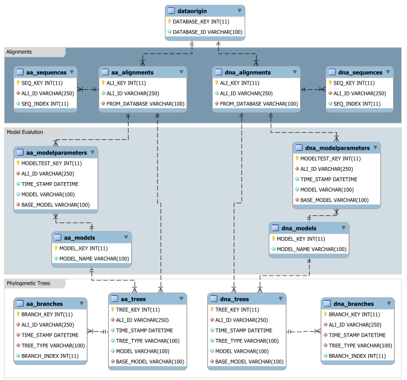

# **The EvoNAPS database**

## **Overview** 

* [Introduction](#introduction)
* [Installation guide](#installation-guide)
* [Create statements](#create-statements)
* [Example import commands](#example-import-commands)

## **Introduction**

The EvoNAPS database was built using the open-source MariaDB Server (v.10.0.13) and holds 13 different tables. An overview of the architecture of the database is given in the figure below. The figure shows an enhanced Entity-relationship-diagram (EER) of the EvoNAPS database using Crow’s feet notation. For simplicity only primary and foreign keys as well as columns involved in constraints are depicted. The figure was created using the reverse engineering tools of the MySQL Workbench software available at https://www.mysql.com/products/workbench/.

More detailed information regarding each table and its columns can be found in the [EvoNAPS_tables.md](EvoNAPS_tables.md) file.

## **Installation guide**

To get the EvoNAPS database running on your local computer, a MySQL (or MariaDB version >10.0.13) instance is required. The source code of MariaDB as well as links to an installation guide can be found here: [MariaDB GitHub](https://github.com/MariaDB/server). An installation guide for MySQL can be found here: [MySQL Instalation Guide](https://dev.mysql.com/doc/mysql-installation-excerpt/5.7/en/).

Once, a MaraDB (or MySQL) server is running on your computer, you can create the EvoNAPS database on your computer using the create statements as described below.

## **Create statements** 

The create statemenets for the EvoNAPS database can be found here: 

* [EvoNAPS_create_statements.sql](EvoNAPS_create_statements.sql)

The script states all create statements for the EvoNAPS database. Overall, there are 13 tables. A short description of each table and of the columns are added as comments. More detailed comments can be viewed in the [EvoNAPS_tables.md](EvoNAPS_tables.md) file. Note, that the create statements need to be executed in the precise order in which they appear in the script. Otherwise, the constraints introduced in some tables will give you an error. 

The create statements serve as clarification to better understand the archtiecture of the EvoNAPS database, namely which constraints apply to which table and wich columns are involved in foreign keys. The [EvoNAPS_create_statements.sql](EvoNAPS_create_statements.sql) file does not include any data. Accordingly, should you execute the file, you will have an empty database. 

## **Example import commands**

Example import commands can be found in the file [EvoNAPS_import_statements.sql](EvoNAPS_import_statements.sql). The file includes example import commands for the files generated by the worfklow as described in [here](../EvoNAPS_workflow/README.md). 

Note, that the import statements need to be executed in the precise order in which they appear in the script. Otherwise, there might be errors due to the constraints imposed on some tables. Also note, that there are different import commands for importing data into the DNA and protein tables! 
