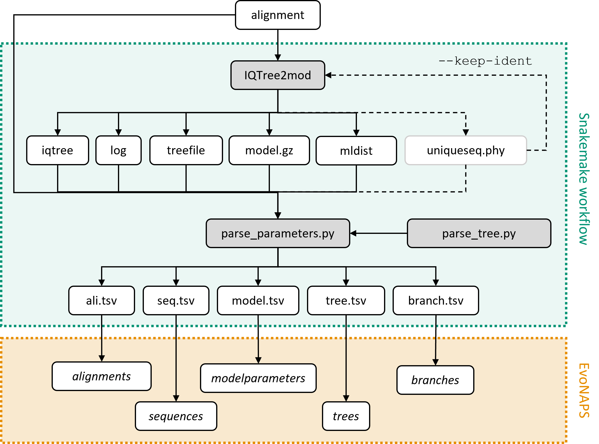

# **The EvoNAPS workflow**

## **Overview** 

* [Introduction](#Introduction)
* [System setup](#system-setup)
* [Manual](#Manuel)
* [Additional scripts](#additional-scripts)
* [References](#References)

## **Introduction**

This workflow was created to generate the data for the EvoNAPS database. The input is an alignment, and the output are the results files generated by the phylogenetic inference software IQ-Tree 2 and 5 tab separated files. The tab separated files were designed to be imported into the corresponding tables in the EvoNAPS database. The figure below schematically depicts the workflow. 

The workflow was written in Snakemake (v5.9.1) (Köster & Rahmann, 2012; Mölder, 2021), a scientific workflow management system that is based on UNIX make and was written in Python. Like UNIX make, the logic of a Snakemake workflow revolves around input and output files that can be generated as described in a set of rules. The rules are defined in a so-called Snakefile. By simply declaring the target output file that you want to produce Snakemake works out the all the required steps and in which order to execute them on its own. 



## **System setup**

### **Download scripts** 

The scripts neccessary for this workflow include the folliwung files:  

* [EvoNAPS_snakefile_aa.smk](EvoNAPS_snakefile_aa.smk)
* [EvoNAPS_snakefile_dna.smk](EvoNAPS_snakefile_dna.smk)
* [get_seed.py](get_seed.py)
* [parse_parameters.py](parse_parameters.py)
* [parse_tree.py](parse_tree.py)

Additionally, the workflow requires a modified version of the phylogenetic inference software IQ-Tree2 (Minh et al., 2020): 

* [iqtree2mod](iqtree2mod)

Download (or copy) all of the mentioned scripts and software into your bin. Alternatively, simply download the entire [EvoNAPS_workflow](../EvoNAPS_workflow/) folder and add it to your PATH environment variable. 

Once completed, the scripts need to be made into executables. Do this by typing: 

```console
name@server:~> chmod +x [script_name]
```

for all scripts mentioned above. Alternatively, download the bash script [make_exe.sh](make_exe.sh), copy it to the folder where your downloaded files lie and run it: 

```console
name@server:~> bash make_exe.sh
```

Once all the mentioned files for the workflow have been downloaded, it is necessary to create the environment required to run the workflow. 

### **Load neccessary modules**

The system setup described here only applies to the CIBIV server. Snakemake as well as the required python libraries are all already installed. Therefore, an installation guide regarding said software will not be included here. 

First load the conda module and activate snakemake. 

```console
name@server:~> module load conda
name@server:~> conda activate snakemake
```
If this step gives you an error, this might be due to a conflict between bioconda and the module python3. If there is an error run: 

```console
name@server:~> module unload python3
```

and then try to activate snakemake again.

Once snakemake is activated, load the python3 module that includes all libraries needed, namely the networkx (v2.2) (Hagberg et al., 2008), pandas (v1.1.3) (McKinney, 2010) and Biopython (v1.78) (Cock et al., 2009) libraries. 

```console
(snakemake) name@server:~> module load python3 
```

Now we are ready to start the workflow on an alignment. The next section will explain how.

## **Manual** 

This section explains how to start the workflow on a given input alignment given the steps as described in [System setup](#system-setup) have been taken. First go to the folder where the alignment file *ali.fasta* that is to be investigated lies: 

```console
(snakemake) name@server:~> cd /PATH/TO/FILE/
```

Assuming the *ali.fasta* file contains a DNA alignment, start the Snakemake workflow by typing the following command onto your terminal: 

```console
(snakemake) name@server:~> snakemake --snakefile EvoNAPS_snakefile_dna.smk [ali.fasta]_ali_parameters.tsv
```

Should the fasta file contain a protein alignment, swap the snakefile with the corresponing aa snakefile [EvoNAPS_snakefile_aa.smk](EvoNAPS_snakefile_aa.smk). 

The target file is the *ali.fasta_ali_parameters.tsv* file. Snakemake will realize that it can produce the target file by applying a set of rules using the alignment file *ali.fasta* as stored in your directory as input.  

Snakemake will start iqtree2mod on the alignment and parse out all relevant information from the output files using the [parse_parameter.py](parse_parameter.py) and [parse_tree.py](parse_tree.py) scripts. 

The results will be stored in the results folder *file.fasta_results/*. The folder contains the output files generated by IQ-Tree 2 and the five *tsv* files as depicted in the figure above. The *tsv* files are designed to be imported into the EvoNAPS database. Example import commands can be found here: [EvoNAPS_import_statements.sql](../EvoNAPS_database/EvoNAPS_import_statements.sql). 

### **Notes to the python scripts**

Should IQ-Tree 2 have employed the heuristic that removes identical sequences from its calculations, then the [get_seed.py](get_seed.py) is required. The [get_seed.py](get_seed.py) script simply reads in the *iqtree* file generated by IQ-Tree 2, searches for the random number seed that has been used for the computations and returns it. The phylogenetic inference of the original and reduced alignment will then be conducted with the same random number seed to make the results comparable. 

All python scripts will be called by Snakemake. Accordingly, there is no need to call each script manually. However, if you still wish to do so, type: 

```console
(snakemake) name@server:~> [NAME_OF_SCRIPT].py --help
```

to get some help on how to run the script. 

## **Additional scripts**

### **Workflow**

The example bash files [example_workflow_aa.sh](example_workflow_aa.sh) and [example_workflow_dna.sh](example_workflow_dna.sh) are short scripts that can be used to apply the Snakemake workflow on all alignments found in a folder. A folder *FOLDER* is hereby required as input. 

```console
(snakemake) name@server:~> bash example_workflow_dna.sh [FOLDER]
```

A log file will be written into *FOLDER/workflow.log*.

Should the workflow have run on an entire folder, for simplicity, the results can be combined into one set of *tsv* files. In this way only one set of *tsv* files need to be imported into the EvoNAPS database as compared to as many as alignments in the folder. The bash script [combine_files.sh](combine_files.sh) can be used to combine all *tsv* files found in the input folder. The combined files will be written into a folder called *FOLDER_results_combined/*. 

```console
(snakemake) name@server:~> bash combine_files.sh [FOLDER]
```

If the workflow is run on a folder using either the [example_workflow_aa.sh](example_workflow_aa.sh) or [example_workflow_dna.sh](example_workflow_dna.sh), there is an additional scripts that checks for potential errors, namely the bash script [check_error.sh](check_errors.sh). As input the target folder is required: 

```console
(snakemake) name@server:~> bash check_errors.sh [FOLDER]
```

The [check_errors.sh](check_errors.sh) script checks for each alignment *ali.fasta* within the target folder if there exists the target file of Snakemake *ali.fasta_tree_parameters* and/or the IQ-Tree 2 output file *ali.fasta.iqtree* file. If either of the two is missing, the script will return a warning. In these cases, it is advisable to delete the whole results folder *ali.fasta_results/* and restart the workflow on the corresponding alignment. 

### **Alignment files**

The alignments as found in the PANDIT database (v17.0) (Whelan et al., 2006) were investigated using the workflow as described above. The results can be found in the EvoNAPS database. The PANDIT database was downloaded as a zipped text file from the EBI webserver (https://www.ebi.ac.uk/research/goldman/software/pandit/). The script [parse_pandit.py](parse_pandit.py) found in this repository was used to parse out all the DNA and AA alignments from the text file *Pandit17.0.gz*. The resulting DNA and AA fasta files were written into the folder *PANDIT-dna/* and *PANDIT-aa/* respectively. 

```console
name@server:~> gunzip Pandit17.0.gz
name@server:~> parse_pandit.py Pandit17.0
```

## **References**

Anaconda Software Distribution. (2020). Anaconda Documentation. Anaconda Inc. Retrieved from https://docs.anaconda.com/

Hagberg, A. A., Schult, D. A., & Swart, P. (2008). Exploring Network Structure, Dynamics, and Function using NetworkX. 

Köster, J., & Rahmann, S. (2012). Snakemake—a scalable bioinformatics workflow engine. Bioinformatics, 28(19), 2520-2522. https://doi.org/10.1093/bioinformatics/bts480 

McKinney, W. (2010). Data Structures for Statistical Computing in Python. Proceedings of the 9th Python in Science Conference. 

Minh, B. Q., Schmidt, H. A., Chernomor, O., Schrempf, D., Woodhams, M. D., von Haeseler, A., & Lanfear, R. (2020). IQ-TREE 2: New Models and Efficient Methods for Phylogenetic Inference in the Genomic Era. Mol Biol Evol, 37(5), 1530-1534. https://doi.org/10.1093/molbev/msaa015 

Peter J. A. Cock, Tiago Antao, Jeffrey T. Chang, Brad A. Chapman, Cymon J. Cox, Andrew Dalke, Iddo Friedberg, Thomas Hamelryck, Frank Kauff, Bartek Wilczynski, Michiel J. L. de Hoon, Biopython: freely available Python tools for computational molecular biology and bioinformatics, Bioinformatics, Volume 25, Issue 11, June 2009, Pages 1422–1423, https://doi.org/10.1093/bioinformatics/btp163

Whelan, S., Bakker, P., Quevillon, E., Rodriguez, N., & Goldman, N. (2006). PANDIT: an evolution-centric database of protein and associated nucleotide domains with inferred trees. Nucleic acids research, 34, D327-331. https://doi.org/10.1093/nar/gkj087 
