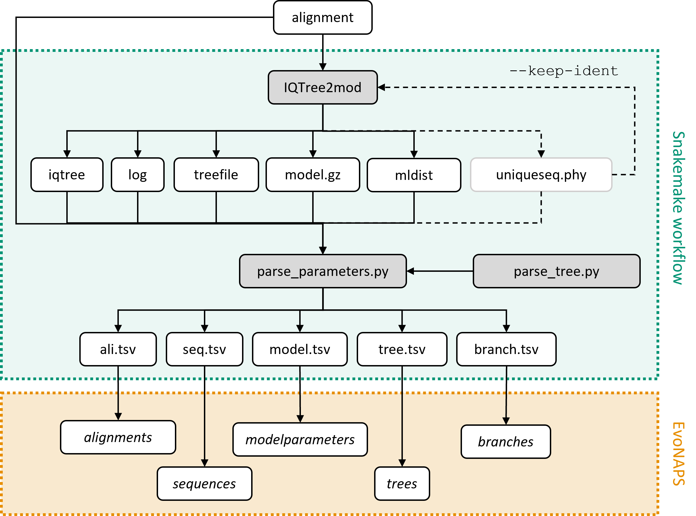

# **Workflow to generate the data for the EvoNAPS database**

## **Overview** 

* [Introduction](#Introduction)
* [System setup](#system-setup)
* [Manual](#Manuel)
* [Additional scripts](#additional-scripts)
* [References](#References)

## **Introduction**

This workflow was created to generate the data for the EvoNAPS database. The input is an alignment, and the output are the result files generated by the phylogenetic inference software IQ-Tree 2 and 5 tab separated files. The tab separated files were designed to be imported into the corresponding tables in the EvoNAPS database. The figure below schematically depicts the workflow. 

The workflow was written in Snakemake (v5.9.1) (Köster & Rahmann, 2012; Mölder, 2021), a scientific workflow management system.



## **System setup**

### **Install Snakemake**

This workflow requires an instance of the workflow managament software Snakemake (tested with version 5.9.1) to be installed on your computer. Installation using conda is recommended. An installation guide can be found here: [installation guide](https://snakemake-api.readthedocs.io/en/stable/getting_started/installation.html#:~:text=Installation%20via%20Conda%2FMamba%201%20Full%20installation%20Snakemake%20can,Notes%20on%20Bioconda%20as%20a%20package%20source%20).

Load the conda module and activate snakemake. 
```console
name@server:~> module load conda
name@server:~> conda activate snakemake
```

Running the workflow reuqires a Snakefile and a number of Python scripts that will be adressed in the next section. 

### **Download scripts** 

The scripts neccessary for this workflow can be found in the scipts folder and include the following files:  

* [EvoNAPS_snakefile_aa.smk](./scripts/EvoNAPS_snakefile_aa.smk)
* [EvoNAPS_snakefile_dna.smk](./scripts/EvoNAPS_snakefile_dna.smk)
* [get_seed.py](./scripts/get_seed.py)
* [parse_parameters.py](./scripts/parse_parameters.py)
* [parse_tree.py](./scripts/parse_tree.py)

The Python scripts were tested using Phython version 3.6.6. The required libraries are listed in the [requirements.txt](./scripts/requirements.txt) file. 

Additionally, the workflow requires a modified version of the phylogenetic inference software IQ-Tree2 (Minh et al., 2020). The source code of the modified version of IQ-Tree2 can be found here: [iqtree2mod_sourcecode](https://github.com/FranziskaReden/iqtree2). The already compiled software is included in this folder: [iqtree2mod](./scripts/iqtree2mod) (Linux).

Download the entire [scripts](scripts) folder and add it to your PATH environment variable. 

Once completed, the Python scripts need to be made into executables. Do this by typing: 

```console
name@server:~> chmod +x [script_name]
```

for all Python scripts mentioned above. 

Now we are ready to start the workflow on an alignment. The next section will explain how.

## **Manual** 

This section explains how to start the workflow on a given input alignment given the steps as described in [System setup](#system-setup) have been taken. First go to the folder where the alignment file *ali.fasta* that is to be investigated lies: 

```console
(snakemake) name@server:~> cd /PATH/TO/FILE/
```

Assuming the *ali.fasta* file contains a DNA alignment, start the Snakemake workflow by typing the following command: 

```console
(snakemake) name@server:~> snakemake --snakefile EvoNAPS_snakefile_dna.smk [ali.fasta]_ali_parameters.tsv
```

Should the fasta file contain a protein alignment, swap the snakefile with the corresponing aa snakefile [EvoNAPS_snakefile_aa.smk](./scripts/EvoNAPS_snakefile_aa.smk). 

The target file is the *ali.fasta_ali_parameters.tsv* file. Snakemake will realize that it can produce the target file by applying a set of rules using the alignment file *ali.fasta* as stored in your directory as input.  

Snakemake will start iqtree2mod on the alignment and parse out all relevant information from the output files using the [parse_parameters.py](./scripts/parse_parameters.py) and [parse_tree.py](./scripts/parse_tree.py) scripts. 

The results will be stored in the results folder *file.fasta_results/*. The folder contains the output files generated by IQ-Tree 2 and the five *tsv* files as depicted in the figure above. The *tsv* files are designed to be imported into the EvoNAPS database. Example import commands can be found here: [EvoNAPS_import_statements.sql](../EvoNAPS_database/EvoNAPS_import_statements.sql). 

### **Notes to the Python3 scripts**

Should IQ-Tree 2 have employed the heuristic that removes identical sequences from its calculations, then the [get_seed.py](scripts/get_seed.py) is required. The [get_seed.py](scripts/get_seed.py) script simply reads in the *iqtree* file generated by IQ-Tree 2, searches for the random number seed that has been used for the computations and returns it. The phylogenetic inference of the original and reduced alignment will then be conducted with the same random number seed to make the results comparable. 

All python scripts will be called by Snakemake. Accordingly, there is no need to call each script manually. However, if you still wish to do so, type: 

```console
(snakemake) name@server:~> [NAME_OF_SCRIPT].py --help
```

to get some help on how to run the script. 

## **Additional scripts**

### **Workflow**

The example bash files [example_workflow_aa.sh](./scripts/example_workflow_aa.sh) and [example_workflow_dna.sh](./scripts/example_workflow_dna.sh) are short scripts that can be used to apply the Snakemake workflow on all alignments found in a folder. A folder *FOLDER* is hereby required as input. 

```console
(snakemake) name@server:~> bash example_workflow_dna.sh [FOLDER]
```

A log file will be written into *FOLDER/workflow.log*.

### **Getting alignment files of the PANDIT database**

The alignments as found in the PANDIT database (v17.0) (Whelan et al., 2006) were investigated using the workflow as described above. 

The PANDIT database was downloaded as a zipped text file from the EBI webserver (https://www.ebi.ac.uk/research/goldman/software/pandit/). The script [parse_pandit.py](PANDIT/parse_pandit.py) found in this repository in folder [PANDIT](./Pandit) was used to parse out all the DNA and AA alignments from the text file *Pandit17.0.gz*. The resulting DNA and AA fasta files are written into the folder *PANDIT-dna/* and *PANDIT-aa/* respectively. 

```console
name@server:~> gunzip Pandit17.0.gz
name@server:~> parse_pandit.py --file Pandit17.0
```

## **References**

Anaconda Software Distribution. (2020). Anaconda Documentation. Anaconda Inc. Retrieved from https://docs.anaconda.com/

Hagberg, A. A., Schult, D. A., & Swart, P. (2008). Exploring Network Structure, Dynamics, and Function using NetworkX. 

Köster, J., & Rahmann, S. (2012). Snakemake—a scalable bioinformatics workflow engine. Bioinformatics, 28(19), 2520-2522. https://doi.org/10.1093/bioinformatics/bts480 

McKinney, W. (2010). Data Structures for Statistical Computing in Python. Proceedings of the 9th Python in Science Conference. 

Minh, B. Q., Schmidt, H. A., Chernomor, O., Schrempf, D., Woodhams, M. D., von Haeseler, A., & Lanfear, R. (2020). IQ-TREE 2: New Models and Efficient Methods for Phylogenetic Inference in the Genomic Era. Mol Biol Evol, 37(5), 1530-1534. https://doi.org/10.1093/molbev/msaa015 

Peter J. A. Cock, Tiago Antao, Jeffrey T. Chang, Brad A. Chapman, Cymon J. Cox, Andrew Dalke, Iddo Friedberg, Thomas Hamelryck, Frank Kauff, Bartek Wilczynski, Michiel J. L. de Hoon, Biopython: freely available Python tools for computational molecular biology and bioinformatics, Bioinformatics, Volume 25, Issue 11, June 2009, Pages 1422–1423, https://doi.org/10.1093/bioinformatics/btp163

Whelan, S., Bakker, P., Quevillon, E., Rodriguez, N., & Goldman, N. (2006). PANDIT: an evolution-centric database of protein and associated nucleotide domains with inferred trees. Nucleic acids research, 34, D327-331. https://doi.org/10.1093/nar/gkj087 
